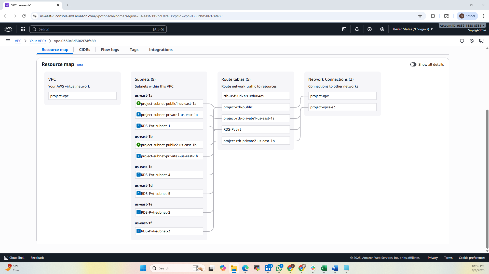
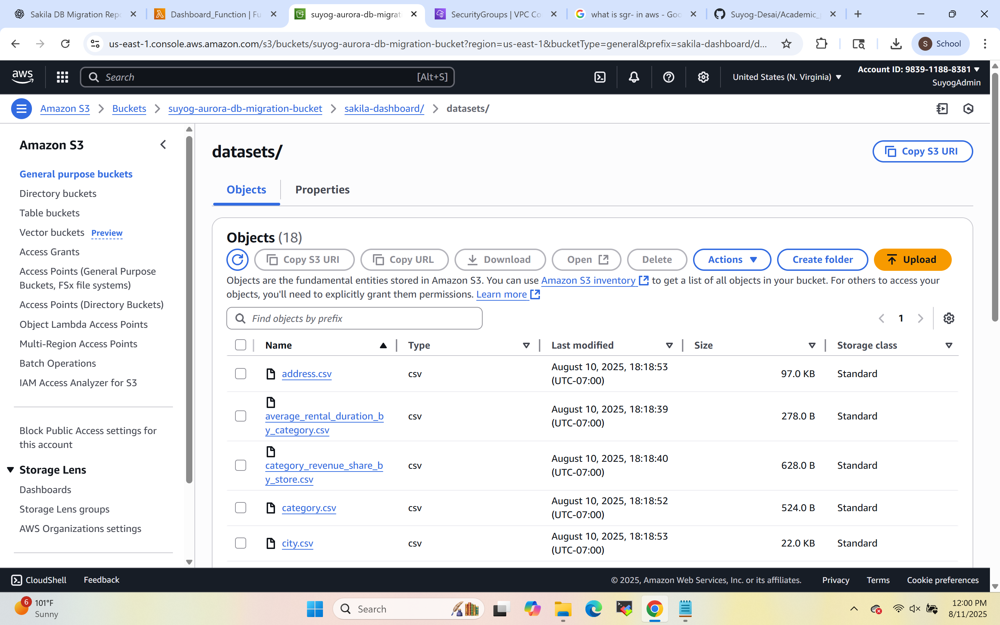
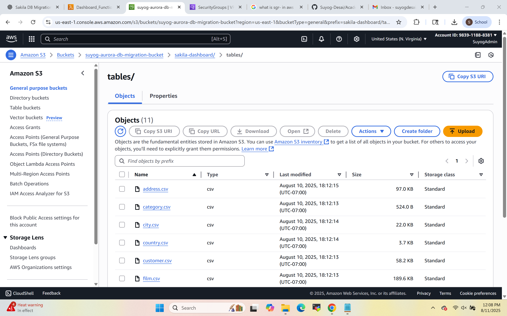
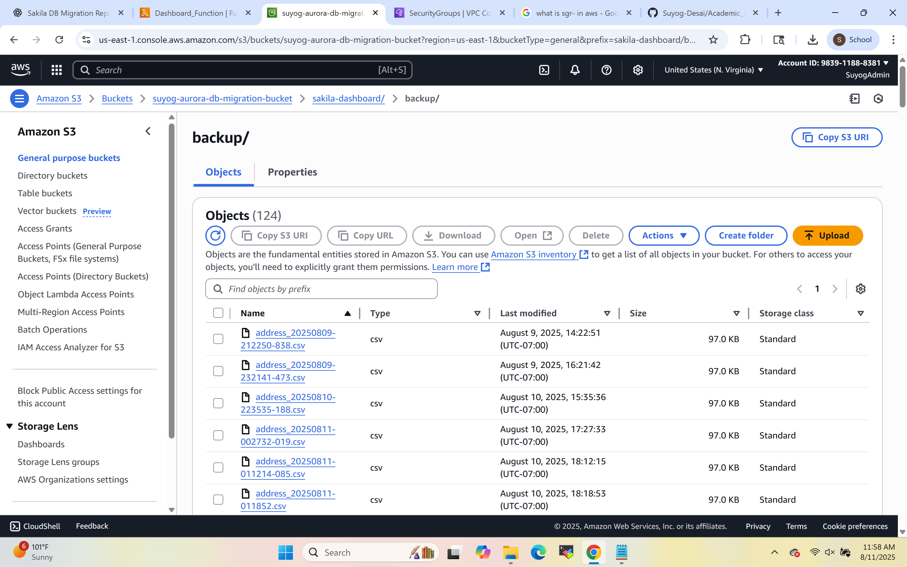
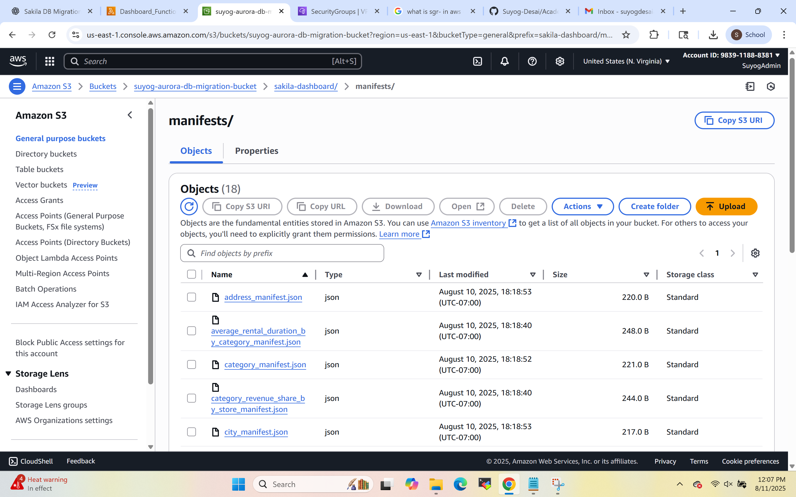

# Sakila Cloud Analytics Pipeline

Migrated the Sakila MySQL database from a local environment to AWS Aurora MySQL in a private VPC, then built a fully automated weekly pipeline that extracts data via Lambda, stores it in S3, and serves it as live dashboards in Amazon QuickSight — all without a NAT Gateway.

---

## Why This Project

Most cloud tutorials hand you a pre-configured environment. I wanted to build one from scratch — VPC, subnets, routing, bastion hosts, Aurora cluster, IAM roles, Lambda, the whole thing — and wire it into an automated analytics pipeline that actually runs on a schedule. The Sakila database was a convenient vehicle for that.

The other constraint I set for myself: **no NAT Gateway**. NAT Gateways are expensive at scale and a crutch. VPC Endpoints solve the same problem for AWS-internal traffic at a fraction of the cost.

---

## Architecture


```
Local MySQL (Sakila dump)
        │
        │ SCP → Bastion Host (EC2, public subnet)
        │
        ▼
Aurora MySQL Cluster (private subnet, 1 writer + 1 reader)
        │
        │ PyMySQL (port 3306)
        ▼
AWS Lambda (private subnet)
   ├── Fetches credentials from Secrets Manager
   ├── Runs SQL queries against Aurora
   ├── Saves results as CSV to S3
   └── Generates QuickSight manifest files
        │
        ▼
Amazon S3 (via S3 Gateway Endpoint — no NAT)
        │
        ▼
Amazon QuickSight Dashboard
   ├── Top 10 most rented movies
   ├── Monthly rental trends
   ├── Revenue by store
   └── Inventory by category

EventBridge  → triggers Lambda weekly
CloudWatch   → SNS notification on Lambda failure
QuickSight   → dataset refresh 3 hours after Lambda run
```

---

## VPC & Network Structure



- Custom VPC in us-east-1 with 4 subnets across 2 AZs (2 public, 2 private)
- Public subnets route through Internet Gateway; private subnets are local-only
- VPC Endpoints for S3 (Gateway), SNS (Interface), and Secrets Manager (Interface) — no NAT Gateway needed
- EC2 Bastion Hosts in public subnets for SSH tunneling into Aurora

---

## What I Built

**Database Migration**
- Exported Sakila dump from local MySQL
- Uploaded to EC2 Bastion Host via SCP
- Restored dump into Aurora MySQL cluster
- Verified data integrity post-import — zero data loss

**Lambda Automation**
- Python Lambda with PyMySQL layer for Aurora connectivity
- Credentials pulled from Secrets Manager at runtime — no hardcoded secrets
- Runs multiple SQL queries, saves results as timestamped CSVs to S3
- Generates manifest files for QuickSight ingestion automatically

**S3 Output Structure**

Dataset folder:



Tables folder:



Backup folder:



Manifest folder:



**QuickSight Dashboards**

Connected QuickSight to S3 via manifest files and built 4 dashboards: rental trends, top movies, store revenue, and inventory by category. Dataset refreshes automatically 3 hours after Lambda runs.

📊 [View Full Dashboard (PDF)](Output/Quicksight_Dashboard.pdf)

---

## Tech Stack

| Service | Role |
|---------|------|
| AWS Aurora MySQL | Cloud database (writer + reader) |
| AWS EC2 (Bastion) | Secure tunnel for DB access and migration |
| AWS Lambda (Python) | Automated query execution and S3 export |
| AWS S3 | CSV storage and QuickSight data source |
| Amazon QuickSight | Interactive dashboards |
| AWS Secrets Manager | Secure credential storage |
| AWS EventBridge | Weekly Lambda scheduling |
| AWS CloudWatch + SNS | Failure alerting |
| VPC Endpoints | Private AWS service connectivity (no NAT) |
| PyMySQL | MySQL connectivity from Lambda |

---

## Security Decisions Worth Highlighting

- Aurora has no public IP — only reachable from Lambda and Bastion security groups
- Bastion hosts restricted to my IP via security group inbound rules
- All DB credentials live in Secrets Manager, never in code or environment variables
- IAM roles scoped to minimum required permissions per service
- Bastion's S3 access role revoked immediately after the migration phase — least privilege enforced throughout

---

## What I'd Add Next

- AWS Glue for more structured ETL before S3 export
- Data quality validation step before QuickSight ingestion
- CI/CD pipeline for Lambda deployments (GitHub Actions → zip → Lambda update)
- SMS alerts via SNS for critical failures
- Automate schema change syncing if the source DB evolves

---

## Author

**Suyog Desai** — [GitHub](https://github.com/Suyog-Desai) · [LinkedIn](https://linkedin.com/in/suyog-desai) · [Portfolio](https://suyogdesai.framer.website)
